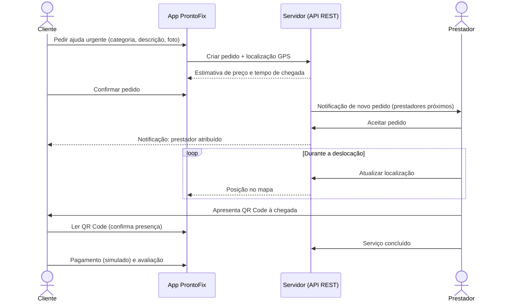
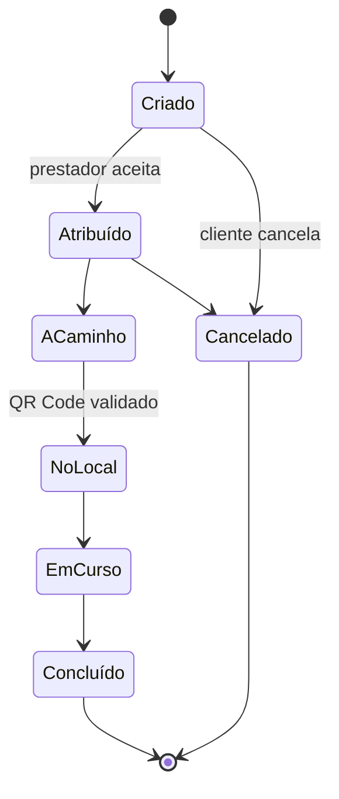
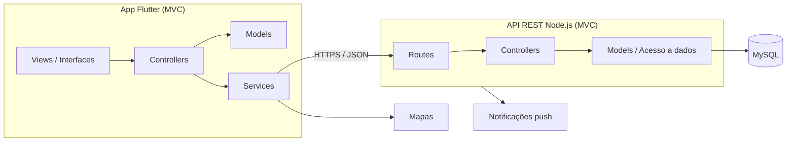

<div align="center">

# 🔧 ProntoFix

**Reparações urgentes ao domicílio, a poucos toques de distância.**

Pede ajuda, acompanha o profissional no mapa e confirma a chegada por QR Code.


**Universidade Europeia | IADE, Faculdade de Design, Tecnologia e Comunicação**
Licenciatura em Engenharia Informática · 3.º semestre · 2026-2027
Projeto Multidisciplinar · **Grupo 04**

</div>

---

## 📚 Documentação

| Documento | Estado | Ligação |
|---|---|---|
| Proposta inicial (v1) | ✅ Entregue (02.10.2026) | [PDF](Documentos/g04-proposta-v1.pdf) · [Markdown](Documentos/g04-proposta-v1.md) |
| Proposta v2 (se houver alterações significativas) | ⏳ Por entregar | n/a |
| Relatório intermédio | ⏳ Por entregar (06.11.2026) | n/a |
| Relatório final | ⏳ Por entregar (11.12.2026) | n/a |
| Memória e arquivo documental | 🚧 Em construção | [`Projeto_ProntoFix/`](Projeto_ProntoFix/) |
| Documentação REST | ⏳ Por entregar | n/a |
| Manual do utilizador | ⏳ Por entregar | n/a |
| Mockups (Figma) | 🚧 Em construção | *(link a adicionar)* |

## 📑 Índice

1. [Sobre o projeto](#-sobre-o-projeto)
2. [Funcionalidades](#-funcionalidades)
3. [Como funciona](#-como-funciona)
4. [Diferenciação face ao mercado](#-diferenciação-face-ao-mercado)
5. [Arquitetura](#-arquitetura)
6. [Tecnologias](#-tecnologias)
7. [Modelo do domínio](#-modelo-do-domínio)
8. [API REST (preliminar)](#-api-rest-preliminar)
9. [Estrutura do repositório](#-estrutura-do-repositório)
10. [Enquadramento nas unidades curriculares](#-enquadramento-nas-unidades-curriculares)
11. [Planeamento](#-planeamento)
12. [Equipa](#-equipa)
13. [Gestão do projeto e convenções](#-gestão-do-projeto-e-convenções)
14. [Como executar](#-como-executar)
15. [Privacidade e RGPD](#-privacidade-e-rgpd)
16. [Estado do projeto](#-estado-do-projeto)

---

## 🎯 Sobre o projeto

### O problema

Quando rebenta um cano, falha a luz ou ficamos trancados fora de casa, encontrar depressa um profissional fiável, com **preço claro** e **tempo de chegada previsível**, é difícil e stressante. Hoje passa por pesquisas, chamadas sucessivas e orçamentos pouco transparentes.

### A solução

O **ProntoFix** liga clientes com uma emergência doméstica ao prestador disponível mais próximo. O cliente descreve o problema, envia uma foto e é localizado por GPS. O pedido segue para os prestadores validados e disponíveis, e o primeiro a aceitar é acompanhado **no mapa em tempo real**. A chegada é confirmada por **QR Code** e o serviço termina com pagamento (simulado) e avaliação.

### Público-alvo

- **Clientes:** pessoas com uma reparação urgente em casa (arrendatários, famílias, idosos).
- **Prestadores:** canalizadores, eletricistas e serralheiros que querem receber pedidos próximos e imediatos.

### Objetivos

1. Criar um pedido urgente em poucos toques (categoria, descrição, foto, localização automática).
2. Atribuir o pedido ao prestador mais próximo, com acompanhamento no mapa em tempo real.
3. Mostrar estimativa de preço e de tempo de chegada antes da confirmação.
4. Validar a presença do prestador no local por QR Code.
5. Registar histórico, avaliações e prestadores favoritos.
6. Disponibilizar uma versão para prestadores (disponibilidade, pedidos, estado do serviço).

---

## ✨ Funcionalidades

### Cliente

| Funcionalidade | Prioridade |
|---|---|
| Registo e início de sessão | Alta |
| Pedido urgente (categoria, descrição, foto) com localização por GPS | Alta |
| Estimativa de preço e de tempo de chegada | Alta |
| Notificação quando um prestador aceita | Alta |
| Acompanhamento do prestador no mapa em tempo real | Alta |
| Confirmação de chegada por QR Code | Média |
| Conclusão, pagamento (simulado) e avaliação | Alta / Média |
| Histórico de pedidos e cancelamento antes da aceitação | Média |
| Repetir pedido e prestadores favoritos | Baixa |

### Prestador

| Funcionalidade | Prioridade |
|---|---|
| Registo com categorias de serviço e validação | Alta |
| Estado "Disponível" e notificações de pedidos próximos | Alta |
| Aceitar ou recusar pedidos e atualizar o estado do serviço | Alta |
| Rota até à morada do cliente | Média |
| Apresentação do QR Code à chegada | Média |
| Ganhos e avaliações recebidas | Baixa |

### Sistema

- Atribuição ao prestador **validado, disponível e da categoria certa** mais próximo.
- Reatribuição automática ao seguinte se não houver resposta num tempo limite.
- Cálculo da estimativa de preço e de tempo de chegada.

> A lista completa de requisitos funcionais (RF01 a RF24) e não funcionais (RNF01 a RNF11) está na [proposta](Documentos/g04-proposta-v1.md), Anexo C.

---

## 🔄 Como funciona



### Estados de um pedido



---

## 🆚 Diferenciação face ao mercado

| | Oscar | Zaask / Habitissimo | **ProntoFix** |
|---|---|---|---|
| Foco em urgências | Parcial | Não | **Sim (core)** |
| Preço | Fixo | Orçamentos | Estimativa transparente à partida |
| Acompanhamento no mapa | Não confirmado | Não | **Sim, em tempo real** |
| Confirmação de chegada | Não confirmado | Não | **QR Code no local** |

A pesquisa de mercado completa está na secção 5 da [proposta](Documentos/g04-proposta-v1.md).

---

## 🏗️ Arquitetura



Princípios:

- Arquiteturas **MVC** e **REST**, tanto no backend como no frontend.
- Código separado em módulos com responsabilidades distintas (modelos, serviços, acesso a dados, interfaces).
- Comunicação cliente-servidor por **HTTPS**, com autenticação por token.
- Novas categorias de serviço podem ser acrescentadas sem alterar o núcleo.

---

## 🧰 Tecnologias

| Camada | Tecnologia |
|---|---|
| App móvel | Flutter · Dart (Android Studio ou Visual Studio Code) |
| Servidor | Node.js · API REST |
| Base de dados | MySQL (modelo relacional) |
| Mapas e localização | Google Maps ou OpenStreetMap *(a decidir)* |
| Notificações | Firebase Cloud Messaging |
| Design | Figma |
| Gestão | GitHub · GitHub Projects |

> Tecnologias provisórias, sujeitas a confirmação ao longo do projeto.

---

## 🗂️ Modelo do domínio


| Entidade | Descrição |
|---|---|
| **Utilizador** | Entidade base (nome, email, telefone, palavra-passe com hash) |
| **Cliente** | Quem pede a reparação |
| **Prestador** | Profissional que executa o serviço (disponibilidade, validação, avaliação média, localização) |
| **Categoria** | Tipo de serviço (canalização, eletricidade, serralharia...) |
| **Pedido** | Pedido urgente (descrição, foto, morada, estado, preços, código QR) |
| **Pagamento** | Pagamento simulado de um pedido |
| **Avaliação** | Avaliação do prestador pelo cliente (1 a 5 estrelas e comentário) |
| **Notificação** | Mensagem enviada a um utilizador |

**Regras de negócio principais**

- Um pedido pertence a um cliente e a uma categoria, e só tem prestador depois de aceite.
- Só prestadores validados e disponíveis, que prestam a categoria do pedido, o recebem.
- Pagamento e avaliação só existem com o pedido concluído (no máximo um de cada).
- O código QR é gerado por pedido e só é válido para o prestador atribuído.

O modelo ER, o dicionário de dados e os ficheiros `create.sql`, `populate.sql` e `queries.sql` serão adicionados na 2.ª entrega.

---

## 🔌 API REST (preliminar)

> Proposta inicial, sujeita a alterações. A documentação completa seguirá o formato indicado no briefing e será adicionada na 2.ª entrega.

| Método | Endpoint | Descrição |
|---|---|---|
| `POST` | `/auth/register` | Registar cliente ou prestador |
| `POST` | `/auth/login` | Iniciar sessão |
| `POST` | `/pedidos` | Criar pedido urgente |
| `GET` | `/pedidos/:id` | Consultar pedido e estado |
| `PATCH` | `/pedidos/:id/cancelar` | Cancelar pedido antes da aceitação |
| `PATCH` | `/pedidos/:id/aceitar` | Prestador aceita pedido |
| `PATCH` | `/pedidos/:id/estado` | Atualizar estado do serviço |
| `POST` | `/pedidos/:id/chegada` | Validar chegada por QR Code |
| `POST` | `/pedidos/:id/avaliacao` | Avaliar prestador |
| `GET` | `/clientes/:id/pedidos` | Histórico do cliente |
| `PATCH` | `/prestadores/:id/disponibilidade` | Ativar ou desativar disponibilidade |
| `PUT` | `/prestadores/:id/localizacao` | Atualizar localização |

---

## 📁 Estrutura do repositório

```
ProntoFix/
├── README.md
├── Documentos/                    # Propostas e relatórios
│   ├── g04-proposta-v1.pdf
│   ├── g04-proposta-v1.md
│   └── img/
├── Projeto_ProntoFix/             # Memória e arquivo documental (estrutura obrigatória)
│   ├── 00_Identificacao/info.md
│   ├── 01_Memoria_Descritiva/memoria.md
│   ├── 02_Imagens/
│   ├── 03_Videos/
│   ├── 04_Documentacao_Tecnica/
│   ├── 05_Artefactos/
│   ├── 06_Dados_Investigacao/
│   └── 07_Autorizacoes/
├── app/                           # (a criar) Aplicação Flutter
└── backend/                       # (a criar) Servidor Node.js e API REST
```

---

## 🎓 Enquadramento nas unidades curriculares

| Unidade curricular | Contributo no ProntoFix |
|---|---|
| Programação de Dispositivos Móveis | App em Flutter/Dart e servidor Node.js com API REST |
| Bases de Dados | Modelo ER e base de dados MySQL com dados de teste |
| Interfaces e Usabilidade | Personas, mockups no Figma, avaliação heurística e de usabilidade |
| Redes e Comunicação de Dados | Arquitetura cliente-servidor e comunicação segura (HTTPS) |
| Matemática Discreta | Pelo menos um método numérico (proposta: Monte Carlo para estimar o tempo de chegada) e estatística sobre avaliações e tempos *(a validar com os docentes)* |

---

## 📅 Planeamento

| Entrega | Data | Conteúdo principal |
|---|---|---|
| **1.ª** | 02.10.2026 | Proposta, arquivo documental, repositório e GitHub Projects |
| **2.ª** | 06.11.2026 | Protótipo alfa (servidor, BD e app), documentação REST v1, `create.sql`, `populate.sql`, `queries.sql`, dicionário de dados |
| **3.ª** | 11.12.2026 | Versão final, relatório, manual do utilizador, poster, vídeo (3 min) e apresentação |


---

## 👥 Equipa

| Elemento | N.º | Área principal | Área de apoio |
|---|---|---|---|
| Emanuel Jacinto | 20251741 | Backend: API REST, autenticação, atribuição de pedidos | Coordenação do grupo e GitHub Projects |
| Paulo Tibúrcio | 20252415 | App Flutter, módulo cliente | Integração app-servidor |
| Márcio Nhanga | 20252075 | Base de dados MySQL | Matemática Discreta |
| Narciso Correia | 20251969 | Design e usabilidade (Figma) | App Flutter, módulo prestador, QR Code, notificações |

**Docentes:** Fabio Guilherme (Projeto de Desenvolvimento Móvel), João Monge (Programação de Dispositivos Móveis), Nathan Campos e Pedro Rosa (Redes e Comunicações de Dados), Miguel Boavida (Bases de Dados), Paula Neves (Interfaces e Usabilidade), André Torcato e Ricardo Sousa (Matemática Discreta).

---

## 🧭 Gestão do projeto e convenções

- **GitHub Projects:** quadro de tarefas baseado na WBS da proposta, com acompanhamento semanal.
- **Ramos (branches):** `main` estável; trabalho em ramos `feature/<nome>` e integração por *pull request*.
- **Commits:** mensagens curtas e descritivas, de preferência no formato `tipo: descrição` (`feat`, `fix`, `docs`, `refactor`, `test`).
- **Documentação:** escrita em markdown no repositório, com PDF exportado para cada entrega.
- **Dados:** apenas dados fictícios.

---

## ▶️ Como executar

> 🚧 O código da aplicação e do servidor será adicionado a partir da 2.ª entrega. Os passos abaixo são o plano e serão confirmados nessa altura.

**Pré-requisitos (previstos):** Flutter SDK, Node.js (LTS), MySQL 8.

1. **Base de dados:** executar `create.sql` e `populate.sql` num servidor MySQL.
2. **Servidor:** na pasta `backend/`, instalar dependências, configurar as variáveis de ambiente (ligação à base de dados e chave de autenticação) e arrancar a API.
3. **App:** na pasta `app/`, obter dependências com `flutter pub get` e executar com `flutter run` num dispositivo ou emulador Android.

---

## 🔒 Privacidade e RGPD

- Todos os dados usados no projeto são **fictícios**.
- Recolha mínima de dados pessoais e **consentimento explícito** para o uso da localização.
- Palavras-passe guardadas com *hash*; comunicação por HTTPS.
- Tratamento de dados sensíveis conforme o Regulamento Geral de Proteção de Dados (UE 2016/679).

---

## 📊 Estado do projeto

- [x] Ideia, problema, público-alvo e pesquisa de mercado
- [x] Guiões de teste e casos de utilização
- [x] Requisitos funcionais e não funcionais
- [x] Modelo do domínio
- [x] Project Charter, WBS e planeamento (Gantt)
- [x] Proposta inicial (v1)
- [ ] Mockups completos no Figma
- [ ] Modelo ER e base de dados
- [ ] API REST
- [ ] App Flutter (cliente e prestador)
- [ ] Notificações, mapa em tempo real e QR Code
- [ ] Testes funcionais e de usabilidade
- [ ] Relatório final, poster e vídeo

---

<div align="center">

Projeto académico · Universidade Europeia | IADE · 2026-2027
Sem licença de utilização definida.

</div>
